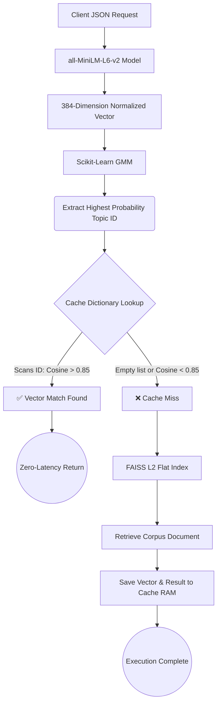

# 🚀 Concept-Aware Search Engine & Vector Cache

**Live API Documentation:** [https://semantic-cache-search.onrender.com/docs](https://semantic-cache-search.onrender.com/docs)

An enterprise-grade retrieval system layered over the 20 Newsgroups corpus. Designed to fulfill the **Trademarkia AI/ML Engineer Task**, this application maps natural language to high-dimensional mathematics, clustering and caching queries intelligently to bypass repetitive embedding operations. 

The entire stack is containerized, memory-optimized for highly restrictive hardware, and deployed from first principles.

---

## 📑 Contents

- [The Retrieval Challenge](#-the-retrieval-challenge)
- [System Topology](#-system-topology)
- [Lifecycle of a Query](#-lifecycle-of-a-query)
- [In-Memory Semantic Caching](#-in-memory-semantic-caching)
- [API Specification](#-api-specification)
- [Deployment & Constraints](#-deployment--constraints)
- [Project Blueprint](#-project-blueprint)
- [Local Installation](#-local-installation)

---

## 🛑 The Retrieval Challenge

Standard text retrieval forces exact lexical overlap. An inquiry about *"vehicle emissions"* naturally misses a document discussing *"car exhaust levels"*. 

Furthermore, processing every incoming user query through a transformer model is computationally expensive. If two users ask the same question in slightly varied ways, a standard system recalculates the vectors and scans the database twice. 

This repository solves both issues by:
1. Translating text into spatial semantic representations.
2. Grouping information into probabilistic boundaries.
3. Establishing an intelligent caching dictionary that understands human paraphrasing.

---

## 🗺️ System Topology

Below is the execution path triggered whenever a payload hits the `/query` endpoint.



---

## 🔬 Lifecycle of a Query

### 1. Vector Mapping
When a string enters the backend, `sentence-transformers` translates it via the lightweight `MiniLM-L6` architecture. We explicitly chose this model as it yields excellent geometric density without requiring multi-gigabyte GPU environments. Vectors are strictly **L2-normalized** to prepare them for optimized mathematical mapping.

### 2. Fast Indexing
We bypassed bulky external services (like Pinecone) over network requests in favor of a locally compiled **FAISS index**. By configuring `IndexFlatIP`, the dot product against our normalized vectors produces mathematically exact Cosine Similarities in fractional milliseconds across ~20,000 document coordinates.

### 3. Probabilistic Boundaries (Clustering)
Documents rarely fit neatly into a single box (e.g., an article on tech legislation intersects both *Law* and *Computers*). We strictly avoided standard K-Means hard logic, instead implementing a **Gaussian Mixture Model (GMM)**. The GMM evaluates probability matrices, allowing the system to assign soft boundaries to the underlying newsgroups text.

---

## 🧠 In-Memory Semantic Caching

### Bypassing Traditional Key-Value Stores
Standard memory stores evaluate strings on a strictly 1:1 basis. *"Who built the first telephone?"* and *"Inventor of the original phone"* calculate as entirely separate dictionary misses, defeating the purpose of an AI-centric backend. 

### Mechanism of Action
To solve lookup latency as the cache grows to millions of entries, our mechanism is structurally localized:
1. The GMM assigns the incoming request to a specific **Domain ID**.
2. The cache dictionary isolates the search purely to vectors trapped within that specific ID. (A user asking about Linux will not trigger cache similarity checks against the Religion queries bucket).
3. If an inner vector clears the tunable confidence threshold, the database is ignored entirely.

### Tuning the Validation Threshold

| Parameter Setup | Operational Behavior |
| :--- | :--- |
| **0.70 Boundary** | **Unstable Recall**. Falsely conflates broad vocabulary. Computes *"How to install RAM"* and *"How to install CPUs"* as the same query. |
| **0.85 Boundary** | **Optimal Baseline**. Strips variations while honoring intent. Equates *"Spaceship launch sequence"* accurately with *"Rocket liftoff protocol"*. |
| **0.95 Boundary** | **Over-fitted Restriction**. Falls back to keyword equivalence. Excludes completely valid human synonyms, starving the cache hit rate. |

---

## 🔌 API Specification

The REST server operates on FastAPI. Open `/docs` on the live server for the Swagger sandbox.

### `POST /query`
Performs the core semantic pipeline logic. 

**Payload:**
```json
{
  "query": "Is Windows OS secure from malware?"
}
```

**Response:**
```json
{
  "query": "Is Windows OS secure from malware?",
  "cache_hit": true,
  "matched_query": "Is Microsoft Windows vulnerable to viruses",
  "similarity_score": 0.892,
  "result": "...",
  "dominant_cluster": 3
}
```

### `GET /cache/stats`
Dumps tracking metrics to monitor active memory reduction.
```json
{
  "total_entries": 105,
  "hit_count": 42,
  "miss_count": 63,
  "hit_rate": 0.400
}
```

### `DELETE /cache`
Safely purges the nested dictionary state maps to simulate a cold boot.

---

## ☁️ Deployment & Constraints

Deploying AI systems onto the typical 512MB RAM free-tier cloud limits results in instant Out-Of-Memory (OOM) fatal kills. I implemented massive system overhauls to stabilize this on **Render**:

1. **Matrix Bypass (`gmm_model.pkl`)**: Calculating the GMM `.fit()` covariance relationships across thousands of geometric points dynamically crashes lightweight hardware. The GMM parameters were mapped locally and dumped into a binary pickle format, entirely avoiding training calculation overhead during cloud boot sequences.
2. **OpenMP Sub-thread Eradication**: Natively, PyTorch consumes system memory greedily attempting to split background handlers across virtual CPUs. I injected OS-level environment variables alongside `torch.set_num_threads(1)` to lock execution strictly to a single, memory-safe pathway.
3. **Dataframe Collection**: Instead of pulling 25MB of raw CSV text into live operational memory, the `VectorStore` init sequence explicitly masks irrelevant layout formats, caching solely the four necessary operational columns to radically slash the memory footprint.
4. **Pre-Cache Docker Instructions**: HuggingFace dynamically streams multi-megabyte weight files directly to RAM at runtime. The appended `Dockerfile` includes static inline executions to write models immediately into the layer build, eliminating runtime network overheads.

---

## 🏗️ Project Blueprint

```text
Semantic_Cache/
├── api/
│   └── main.py                     # FastAPI Routing
├── data/
│   ├── embeddings/
│   │   ├── faiss_index.bin         # Live DB parameters
│   │   └── gmm_model.pkl           # Pre-calculated distribution nodes
│   └── processed/
│       └── newsgroups_clustered.csv
├── notebooks/                      # Data pipeline algorithms
│   ├── 01_data_preparation.ipynb
│   ├── 02_embeddings_vector_db.ipynb
│   └── 03_fuzzy_clustering.ipynb
├── src/                            # Core Class logic
│   ├── clustering.py               
│   ├── embedding_model.py
│   ├── semantic_cache.py
│   └── vector_store.py
├── Dockerfile                      # Memory-optimized containerization
├── README.md                       
└── requirements.txt
```

---

## ⚙️ Local Installation

You can pull down the exact environment easily:

**Via Docker:**
```bash
docker build -t cache-engine .
docker run -p 8000:8000 cache-engine
```

**Via Native Python:**
```bash
python -m venv .venv
# source .venv/bin/activate (Unix) or .venv\Scripts\activate (Windows)

pip install -r requirements.txt
uvicorn api.main:app --host 0.0.0.0 --port 8000
```