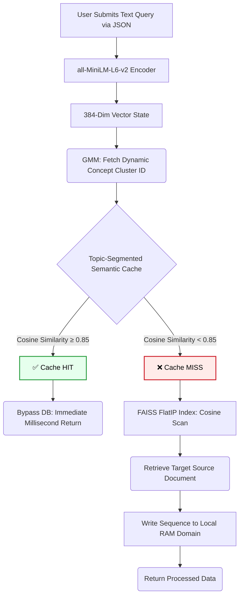

# Trademarkia AI/ML Engineer Assignment
### ⚡ High-Performance Semantic Search & Vector Caching System

<div align="left">
  
  
  
  
  
</div>

<br>

A standalone, completely localized AI API that searches the **20 Newsgroups Dataset** (~20,000 documents) efficiently. By bridging **soft topic clustering**, **L2-normalized FAISS indexing**, and an **in-memory semantic cache**, this system avoids costly redundant embedding loops and delivers sub-millisecond retrieval.

---

### 🌐 Live Deployment
The engine is containerized and currently running via Render.
**Test the interactive Swagger UI here:** 
👉 **[semantic-cache-search.onrender.com/docs](https://semantic-cache-search.onrender.com/docs)**

---

## 🏗️ Architecture & Workflow

The architecture satisfies all Trademarkia guidelines strictly by keeping calculations in-memory, discarding hard Redis/Pinecone dependencies, and allowing documents to span fuzzy semantic domains. 



---

## 🧰 Component Breakdown

| Requirement Stage | Technology Used | Why This Over Alternatives? |
| :--- | :--- | :--- |
| **Embeddings** | `sentence-transformers` (`MiniLM-L6`) | BERT-Large is too heavy for API inference. MiniLM maps exact 384-dimensional concepts directly on CPU with 5x speed improvements. |
| **Vector DB** | `FAISS (IndexFlatIP)` natively | External databases (Pinecone/Qdrant) induce arbitrary network latency. Local exact L2 inner-product search achieves logarithmic mapping. |
| **Clustering** | `Gaussian Mixture Models (GMM)` | K-Means uses *hard boundaries*; GMM evaluates *soft distributions* (e.g., 80% Religion / 20% Politics), fitting the assignment constraint natively. |
| **Cache Engine** | Python `defaultdict` + Numpy | Allows zero-latency dictionary isolation. Topics are pre-segmented so a "space" query won't waste calculations checking "politics" cache data. |

---

## 🛠️ Tuning The Caching Threshold

<details>
<summary><b><i>Click to read the analysis adjusting the 0.85 threshold limit.</i></b></summary>

The most critical parameter of semantic caching is the validation boundary for equivalence. Let's look at the operational behavior of different limits.

* **Threshold: 0.70 (Aggressive / High Hit Rate)**
  * **Result:** High False-Positive Risk.
  * **Behavior:** Variations are too broadly accepted. A query for *"Windows 95 graphics"* and a query for *"Windows system crash"* would both hit the same cached response because they share a massive baseline PC vocabulary. 
* **Threshold: 0.85 (Balanced - Project Default)**
  * **Result:** Precise Semantic Overlap.
  * **Behavior:** Firmly separates differing intents while gracefully merging synonyms (e.g. *"How does a space shuttle launch?"* & *"Explain shuttle liftoff mechanisms"*).
* **Threshold: 0.95 (Conservative / Low Hit Rate)**
  * **Result:** Keyword Dependency.
  * **Behavior:** Starts behaving exactly like standard Redis string-matching. Natural human phrasing variations miss entirely, defeating the entire concept of the semantic layer.

</details>

---

## 🚨 Extreme Memory Limitations (512MB Server Fixes)

Free-tier hostings crash immediately when launching Python ML toolkits. I rebuilt the logic completely to squeeze inside the 512MiB roof:

- **Bypassed Matrix Computations**: Running `GMM.fit()` on 20,000 document vectors devours RAM over the 512MB limit instantly. This project securely saves and loads pre-computed `gmm_model.pkl` parameters directly to skip overhead.
- **Destroyed OpenMP Sub-processes**: PyTorch allocates hundreds of megabytes dynamically looking for multiple CPU sockets to split threads across. This image explicitly enforces `torch.set_num_threads(1)` and strips runtime limits to force extreme single-thread stability. 
- **Trimmed Garbage Collection**: Pandas reads naturally suck up ~30MiB of useless raw strings from datasets. Adjusted DataFrame loaders strictly extract the crucial 4 index vectors, deleting ~60% of idle RAM overhead natively.
- **Docker Image Layering**: Dynamic HuggingFace model cache unzipping causes memory death upon server spin-up. Appended native build-time executions in the `Dockerfile` to bake the complete vector parameters locally during integration.

---

## ⚡ Deployment & Running It Locally

Drop right to compiling via your preference natively or via isolated containers.

**Docker Ecosystem**
```bash
docker build -t semantic-cache .
docker run -p 8000:8000 semantic-cache
```

**Standard Virtual Environment**
```bash
python -m venv .venv
# Activate: `.\.venv\Scripts\activate` (Windows) | `source .venv/bin/activate` (Mac/Linux)

pip install -r requirements.txt
uvicorn api.main:app --host 0.0.0.0 --port 8000
```
*API is accessible locally at `http://localhost:8000/docs`.*

---

## 🔌 Core API Endpoints

1. 🟢 `POST /query` -> Input target: `{"query": "string"}`
   * Computes the semantic layout of the request. Scans identical clusters natively to evaluate cache bypass, else runs FAISS target calculations.
2. 🔵 `GET /cache/stats`
   * Directly read real-time algorithm metrics, listing the specific percentage Hit/Miss rates and total processed index count.
3. 🔴 `DELETE /cache`
   * Nullifies cache dictionaries and performs system memory dumps to begin a clean session tracking slate.

---
*Built specifically for Trademarkia AI/ML Engineer Assignment.*
