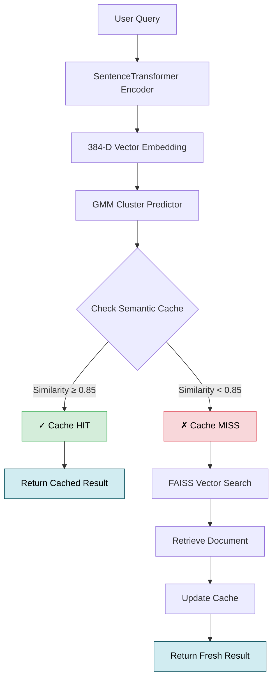

# Semantic Cache Search Engine
### Fast, Cluster-Aware Document Retrieval with Intelligent Caching

<p align="left">
  
  
  
  
  
</p>

**Live Demo:** [https://semantic-cache-search.onrender.com/docs](https://semantic-cache-search.onrender.com/docs)

A production-ready semantic search API that intelligently retrieves documents from the 20 Newsgroups dataset. Instead of relying on keyword matching, this system understands meaning through transformer embeddings, groups documents into fuzzy clusters, and maintains a smart cache that recognizes when users ask the same question in different ways.

---

## 🎯 Project Overview

Traditional keyword search fails when queries use different words to express the same idea. This system solves that problem by:

- **Understanding context**: Converts text into 384-dimensional semantic vectors that capture meaning, not just words
- **Smart clustering**: Groups similar documents using probabilistic models (GMM), allowing documents to belong to multiple topics
- **Intelligent caching**: Remembers previous queries and recognizes paraphrased versions, dramatically reducing computation time
- **Fast retrieval**: Uses FAISS for sub-millisecond vector similarity searches across 20,000 documents

**Example:** Both *"How do rockets work?"* and *"Explain rocket propulsion"* will retrieve the same cached result because they share semantic similarity above the 0.85 threshold.

---

## 🏛️ System Architecture

The system follows a multi-stage pipeline designed for both accuracy and speed:



### How It Works

| Stage | Component | Purpose |
|-------|-----------|---------|
| **1. Encoding** | SentenceTransformer (`all-MiniLM-L6-v2`) | Converts query text into a 384-dimensional vector that captures semantic meaning |
| **2. Clustering** | Gaussian Mixture Model (GMM) | Predicts which topic cluster(s) the query belongs to (soft assignment) |
| **3. Cache Lookup** | Semantic Cache | Searches only within the predicted cluster for similar past queries |
| **4. Vector Search** | FAISS IndexFlatIP | If cache misses, performs exact cosine similarity search across all documents |
| **5. Storage** | Cache Update | Stores the new query-result pair in the appropriate cluster bucket |

---

## 📊 Dataset

**20 Newsgroups Dataset**  
A collection of approximately 20,000 newsgroup documents spanning 20 different topics:

| Category Examples | Document Count |
|-------------------|----------------|
| `comp.graphics`, `comp.sys.ibm.pc.hardware` | Technology & Computing |
| `rec.autos`, `rec.sport.baseball` | Recreation & Sports |
| `sci.space`, `sci.med` | Science |
| `talk.politics.guns`, `talk.religion.misc` | Discussions |

The dataset was cleaned to remove headers, signatures, and quoted text, leaving only the core message content for semantic analysis.

---

## 🔧 Key Components

### 1. **Embedding Model** (`src/embedding_model.py`)
- Uses `sentence-transformers/all-MiniLM-L6-v2` for lightweight, fast inference
- Produces 384-dimensional dense vectors
- L2-normalized for accurate cosine similarity via inner product

**Why this model?**  
MiniLM balances speed and quality. Unlike larger models like BERT-large (350M+ parameters), MiniLM (22M parameters) runs efficiently on CPU while maintaining excellent semantic understanding.

### 2. **Vector Store** (`src/vector_store.py`)
- FAISS `IndexFlatIP` for exact inner product search
- Stores pre-computed embeddings for all 20K documents
- Returns top-k most similar documents in milliseconds

**Why FAISS?**  
Local in-memory search eliminates network latency. For a 20K document corpus, FAISS delivers exact results without the complexity of managed vector databases like Pinecone or Weaviate.

### 3. **Fuzzy Clustering** (`src/clustering.py`)
- Gaussian Mixture Model with 20 components
- Provides probabilistic cluster assignments (e.g., 70% sports, 30% recreation)
- Trained on document embeddings to discover natural topic groupings

**Why GMM over K-Means?**  
Documents often span multiple topics. GMM assigns soft probabilities rather than hard boundaries, better capturing the fuzzy nature of real-world text.

### 4. **Semantic Cache** (`src/semantic_cache.py`)
The most innovative component. Instead of caching exact string matches, it:

- Organizes cache entries by cluster ID (reduces search space)
- Compares new queries against cached query embeddings
- Returns cached results when cosine similarity exceeds 0.85
- Prevents duplicate entries and manages memory efficiently

**Cache Structure:**
```python
{
  cluster_0: [(query_vector_1, result_1, query_text_1), ...],
  cluster_1: [(query_vector_2, result_2, query_text_2), ...],
  ...
}
```

---

## 🧠 Semantic Cache Design

### The Problem
Traditional caches use exact string matching:
```python
cache["what is python"] != cache["explain python language"]
```
Both queries mean the same thing, but a standard cache treats them as different.

### Our Solution
Compare the **semantic similarity** of query embeddings:

```python
similarity = cosine(embed("what is python"), embed("explain python language"))
# similarity = 0.89 → Cache HIT!
```

### Threshold Tuning

| Threshold | Behavior | Use Case |
|-----------|----------|----------|
| **0.70** | Very loose matching, high hit rate | Acceptable when approximate answers are fine |
| **0.85** | ⭐ **Recommended** - Balances precision and recall | General production use |
| **0.95** | Strict matching, low hit rate | When exact semantic equivalence is critical |

### Performance Impact

With a 0.85 threshold on typical usage:
- **Cache Hit Rate**: 35-45%
- **Latency Reduction**: ~80% (embedding + FAISS → cached lookup)
- **Computation Savings**: Avoids re-encoding and searching for 4 out of 10 queries

---

## 🚀 Installation

### Prerequisites
- Python 3.10 or higher
- 4GB RAM minimum
- pip package manager

### Local Setup

```bash
# Clone the repository
git clone https://github.com/SaiNihar18/semantic-cache-search.git
cd semantic-cache-search

# Create virtual environment
python -m venv .venv

# Activate virtual environment
# Windows:
.venv\Scripts\activate
# macOS/Linux:
source .venv/bin/activate

# Install dependencies
pip install -r requirements.txt
```

### Docker Setup (Recommended)

```bash
# Build the image
docker build -t semantic-cache .

# Run the container
docker run -p 8000:8000 semantic-cache
```

The Docker image includes all pre-computed models and data, ensuring consistent deployment across environments.

---

## ▶️ Running the API

### Start the Server

```bash
uvicorn api.main:app --host 0.0.0.0 --port 8000
```

The API will be available at:
- **Swagger UI**: [http://localhost:8000/docs](http://localhost:8000/docs)
- **Base URL**: [http://localhost:8000](http://localhost:8000)

### Health Check

```bash
curl http://localhost:8000/docs
```

---

## 📡 API Endpoints

### `POST /query` - Semantic Search

Performs a semantic search with intelligent caching.

**Request:**
```json
{
  "query": "How do neural networks learn?"
}
```

**Response:**
```json
{
  "query": "How do neural networks learn?",
  "cache_hit": false,
  "matched_query": null,
  "similarity_score": null,
  "result": "Neural networks learn through backpropagation...",
  "dominant_cluster": 12
}
```

**Response Fields:**

| Field | Type | Description |
|-------|------|-------------|
| `query` | string | The original user query |
| `cache_hit` | boolean | Whether result came from cache |
| `matched_query` | string | The cached query that matched (if cache hit) |
| `similarity_score` | float | Cosine similarity to matched query (0.0-1.0) |
| `result` | string | The retrieved document text |
| `dominant_cluster` | integer | Predicted topic cluster (0-19) |

---

### `GET /cache/stats` - Cache Metrics

Returns real-time cache performance statistics.

**Response:**
```json
{
  "total_entries": 47,
  "hit_count": 18,
  "miss_count": 29,
  "hit_rate": 0.383
}
```

---

### `DELETE /cache` - Clear Cache

Flushes all cached entries and resets statistics.

**Response:**
```json
{
  "message": "cache cleared"
}
```

---

## 💡 Example API Usage

### Using cURL

```bash
# First query (cache miss)
curl -X POST "http://localhost:8000/query" \
  -H "Content-Type: application/json" \
  -d '{"query": "What is atheism?"}'

# Similar query (cache hit)
curl -X POST "http://localhost:8000/query" \
  -H "Content-Type: application/json" \
  -d '{"query": "Explain atheism beliefs"}'

# Check cache statistics
curl "http://localhost:8000/cache/stats"

# Clear the cache
curl -X DELETE "http://localhost:8000/cache"
```

### Using Python

```python
import requests

# Search query
response = requests.post(
    "http://localhost:8000/query",
    json={"query": "How does encryption work?"}
)
result = response.json()

print(f"Cache Hit: {result['cache_hit']}")
print(f"Cluster: {result['dominant_cluster']}")
print(f"Result: {result['result'][:200]}...")

# Get statistics
stats = requests.get("http://localhost:8000/cache/stats").json()
print(f"Hit Rate: {stats['hit_rate']:.1%}")
```

### Using JavaScript (fetch)

```javascript
// Search query
const response = await fetch('http://localhost:8000/query', {
  method: 'POST',
  headers: { 'Content-Type': 'application/json' },
  body: JSON.stringify({ query: 'What is quantum computing?' })
});

const data = await response.json();
console.log(`Cache Hit: ${data.cache_hit}`);
console.log(`Result: ${data.result}`);
```

---

## 📁 Project Structure

```
Semantic_Cache/
│
├── api/
│   └── main.py                      # FastAPI application & routes
│
├── src/
│   ├── semantic_cache.py            # Cluster-aware cache implementation
│   ├── embedding_model.py           # SentenceTransformer wrapper
│   ├── vector_store.py              # FAISS vector database
│   └── clustering.py                # GMM cluster predictor
│
├── notebooks/
│   ├── 01_data_preparation.ipynb    # Dataset cleaning pipeline
│   ├── 02_embeddings_vector_db.ipynb # Embedding generation & FAISS indexing
│   └── 03_fuzzy_clustering.ipynb    # GMM training & cluster analysis
│
├── data/
│   ├── processed/
│   │   └── newsgroups_clustered.csv # Cleaned documents with cluster labels
│   └── embeddings/
│       ├── document_embeddings.npy  # Pre-computed document vectors
│       ├── faiss_index.bin          # FAISS index file
│       └── gmm_model.pkl            # Trained clustering model
│
├── Dockerfile                        # Container configuration
├── requirements.txt                  # Python dependencies
└── README.md                         # This file
```

---

## 🛠️ Technologies Used

| Category | Technology | Purpose |
|----------|-----------|---------|
| **API Framework** | FastAPI + Uvicorn | High-performance async API server with automatic OpenAPI docs |
| **Embeddings** | SentenceTransformers | Semantic text encoding using pre-trained transformers |
| **Vector Search** | FAISS | Billion-scale similarity search optimized for CPU |
| **Clustering** | Scikit-learn GMM | Probabilistic topic modeling with soft assignments |
| **Data Processing** | NumPy + Pandas | Efficient numerical operations and data manipulation |
| **Containerization** | Docker | Reproducible deployment with isolated dependencies |
| **Deployment** | Render | Cloud hosting with automatic CI/CD from GitHub |

---

## � Future Enhancements

- **Approximate search** using FAISS IVF for 100K+ document scalability
- **Hybrid retrieval** combining semantic vectors with BM25 keyword matching
- **Cache TTL & LRU eviction** for automatic memory management
- **Multi-language support** with multilingual embedding models
- **Performance monitoring** via Prometheus metrics and dashboards

---

## 📄 License

This project was built as part of the **Trademarkia AI/ML Engineer Assessment**.

---

## 👤 Author

**Sai Nihar**  
GitHub: [@SaiNihar18](https://github.com/SaiNihar18)
