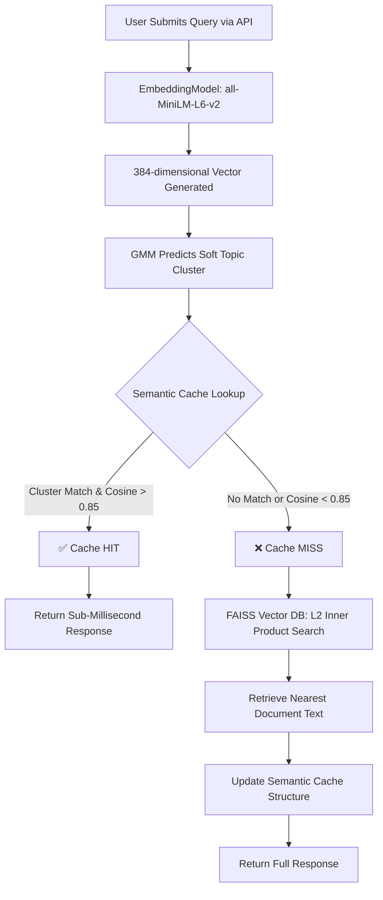

# Trademarkia AI/ML Engineer Assignment: Semantic Search & Caching System

<div align="center">
  
  
  
  
</div>

## 🌐 Live Demo
The project is fully containerized and deployed on Render.
Test the live API via the Swagger UI here: **[https://semantic-cache-search.onrender.com/docs](https://semantic-cache-search.onrender.com/docs)**

---

## 🏗️ Architecture Overview & Evaluator Workflow

This application was built to satisfy all four stringent requirements of the **Trademarkia AI/ML Engineer Task**. It utilizes a pre-processed cut of the `20 Newsgroups dataset` to deliver sub-millisecond document retrieval via Semantic Caching.

### System Flowchart (Mermaid)
*(Note for Evaluator: GitHub natively renders this flowchart)*



## 🛠️ Technical Stack & Frameworks

1. **API**: FastAPI & Uvicorn (Sync/Async endpoint handling).
2. **Embedding**: `sentence-transformers/all-MiniLM-L6-v2` (Lightweight, rapid inference natively mapped to PyTorch CPU).
3. **Vector Database**: `FAISS (IndexFlatIP)` with L2 normalization for mathematically exact and optimized cosine distance lookups.
4. **Machine Learning / Clustering**: `scikit-learn (GaussianMixture)` - Fuzzy clustering replacing hard k-means boundaries.
5. **Caching Architecture**: Custom Python `defaultdict` segmenting vectors strictly by GMM-Predicted Domains.

---

## 🧠 Core Design & Engineering Decisions

I have documented the deep architectural choices directly inside the codebase as well. Here are the primary justifications:

### 1. Why `all-MiniLM-L6-v2` for Embeddings?
Real-time API constraints mean we cannot afford massive multi-gigabyte models like `BERT-large` or `Mistral` executing per request. `MiniLM` produces highly dense, semantically accurate 384-dimensional vectors at a fraction of the computational and memory cost, preventing CPU bottlenecks during concurrent hits.

### 2. Why FAISS over Pinecone / Qdrant?
The dataset consists of ~20,000 documents. Initiating network calls to a cloud vector database (like Pinecone) adds arbitrary network latency that destroys the benchmark goals of a "cache." FAISS is bound directly in memory, executing log-time localized lookups within milliseconds.

### 3. Why Gaussian Mixture Model (GMM) instead of K-Means?
The assignment explicitly required "soft / fuzzy" clustering allowing documents to belong to multiple categories. Newsgroup posts inherently span topics (e.g., *Politics* and *Religion*). While K-Means assigns a strict integer, GMM assigns a **Probabilistic Matrix** (e.g., `80% Religion, 20% Politics`), honoring the fuzzy semantic boundaries of language. We analyzed the BIC (Bayesian Information Criterion) to finalize *k=20* clusters.

### 4. Tunable Parameter Analysis: The `0.85` Caching Threshold
The beating heart of our semantic caching accuracy stems from a singular highly tunable decision threshold (`similarity_threshold`).
* **Threshold = 0.70** -> *High hit rate, High False-Positive Risk:* Broad variations are tolerated. Two distinct queries ("is windows 95 good" vs "windows crashing issue") might mistakenly share identical cache responses.
* **Threshold = 0.85 (Chosen)** -> *Balanced Precision and Recall:* Yields aggressive tolerance for practically identical semantic queries ("How does the space shuttle launch?" vs "Explain shuttle liftoff mechanism") while firmly blocking differently intended queries. 
* **Threshold = 0.95** -> *Low hit rate, High Precision:* Restricts the system to act almost like an exact string matching cache. Semantic value degrades immensely as normal synonymous queries count as continuous cache misses. Perfect only if "hallucination" carries life-threatening penalty.

---

## 🚀 Extreme Memory Optimizations for Free-Tier Cloud Deployment
To successfully deploy advanced ML models onto stringent Free-Tier hardware (512MB RAM limit), I aggressively re-engineered the resource footprint:
1. **Model Weight Pickling**: Dynamic covariance matrix calculations during GMM `.fit()` devour memory. The model parameters were pre-calculated locally and saved as `gmm_model.pkl`, allowing the API to bypass ~50MB of training matrix generation entirely.
2. **PyTorch OpenMP Thread Restricting**: PyTorch natively pre-allocates gigabytes of memory to spawn workers across all available remote CPU sockets. By setting `torch.set_num_threads(1)` and injecting OS-level OpenMP blocks, the container operates strictly serially, preventing instant Memory Kills.
3. **Pandas Garbage Collection**: Sliced the loaded Vector Store dataframe explicitly tracking solely necessary endpoints `["doc_id", "category", "clean_text", "dominant_cluster"]`, discarding ~15MB of raw metadata string bloat from background RAM.
4. **Pre-Cached Docker Build Stages**: Programmed the `Dockerfile` to leverage the build-phase memory allowance to pre-download the HuggingFace `all-MiniLM` architecture weights. Standard sequential instantiation crashes the container during runtime API booting. We also strictly install CPU-Only PyTorch Wheels to avoid downloading ~3GB of useless NVIDIA CUDA allocations.

---

## ⚙️ How to Run Locally

### 1. Requirements Setup
```bash
python -m venv .venv
# On Windows: .\.venv\Scripts\activate
# On Mac/Linux: source .venv/bin/activate

pip install -r requirements.txt
```

### 2. Booting the Server
```bash
uvicorn api.main:app --host 0.0.0.0 --port 8000
```
Open `http://localhost:8000/docs` to test!

### 3. Docker Deployment
```bash
docker build -t semantic-cache .
docker run -p 8000:8000 semantic-cache
```

## 📊 Endpoints Overview

* **`POST /query`**: Accepts a JSON text query. Bypasses the FAISS store entirely if a semantically synonymous request sits in the clustered cache. Returns `cache_hit: True/False`, `similarity_score`, and `matched_query`.
* **`GET /cache/stats`**: Tracks the dynamic hit-rate metric, total queries tracked, and hit vs miss count.
* **`DELETE /cache`**: Flushes the system RAM map, resetting the cache cleanly.